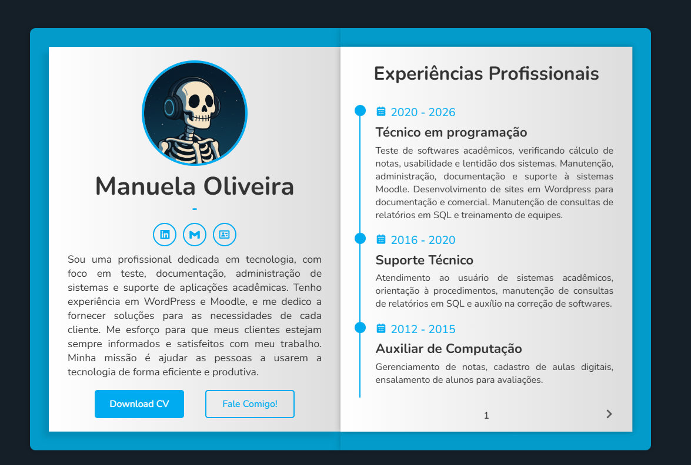

# 🌐 Portfólio — Manuela Oliveira

Portfólio pessoal desenvolvido com HTML, CSS e JavaScript puro, apresentando minha trajetória profissional, formação acadêmica, habilidades e projetos na área de tecnologia.

[](https://oliveiramannuh.github.io/portfolio/)
[](./LICENSE)

---

## 📸 Preview



---

## 👩‍💻 Sobre

Sou uma profissional dedicada em tecnologia, com foco em **testes de software**, **documentação**, **administração de sistemas Moodle e Wordpress** e **suporte a aplicações acadêmicas**. Tenho experiência com WordPress, Moodle e SQL, e busco sempre entregar soluções eficientes e centradas no usuário.

---

## 🛠️ Tecnologias Utilizadas

- **HTML5** — Estrutura das páginas
- **CSS3** — Estilização e responsividade
- **JavaScript** — Interatividade e comportamento do site

---

## 📂 Estrutura do Projeto

```
portfolio/
├── index.html         # Página principal
├── style.css          # Estilos globais
├── script.js          # Scripts de interação
├── Logo.png           # Logo pessoal
├── favicon.ico        # Ícone do site
├── website 3.png      # Screenshot do portfólio
├── cv/                # Currículo em PDF
└── LICENSE            # Licença MIT
```

---

## 🚀 Como Visualizar Localmente

1. Clone o repositório:
   ```bash
   git clone https://github.com/OliveiraMannuh/portfolio.git
   ```

2. Acesse a pasta:
   ```bash
   cd portfolio
   ```

3. Abra o arquivo `index.html` no seu navegador — ou utilize a extensão **Live Server** no VS Code para uma experiência com reload automático.

---

## 📌 Seções do Portfólio

- **Sobre mim** — Apresentação e resumo profissional
- **Experiências Profissionais** — Histórico de atuação desde 2012
- **Formação Acadêmica** — Graduação, pós-graduação e técnico em informática
- **Serviços** — WordPress, UX Design, Testes e Documentação
- **Habilidades** — HTML, CSS, Python, PHP, Figma, Selenium, Cypress
- **Projetos** — Repositórios com automação de testes
- **Contato** — E-mail e redes sociais

---

## 📬 Contato

- 📧 [oliveira.mannuh@gmail.com](mailto:oliveira.mannuh@gmail.com)
- 💼 [LinkedIn](https://www.linkedin.com/in/manuela-oliveira-da-silva)
- 🐙 [GitHub](https://github.com/OliveiraMannuh)

---

## 📄 Licença

Este projeto está licenciado sob a [MIT License](./LICENSE).